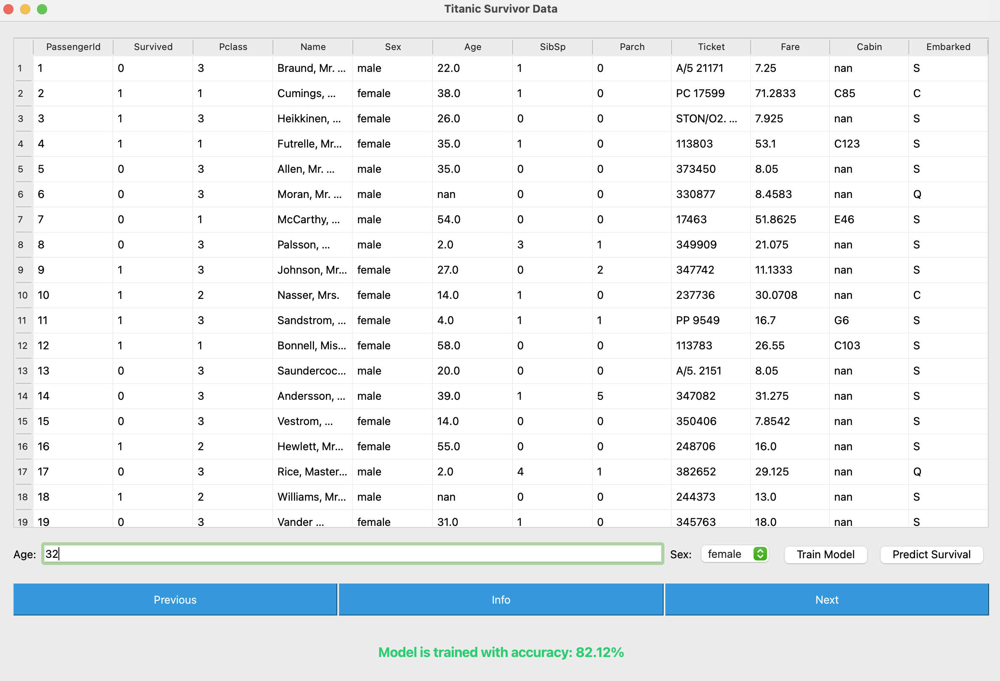
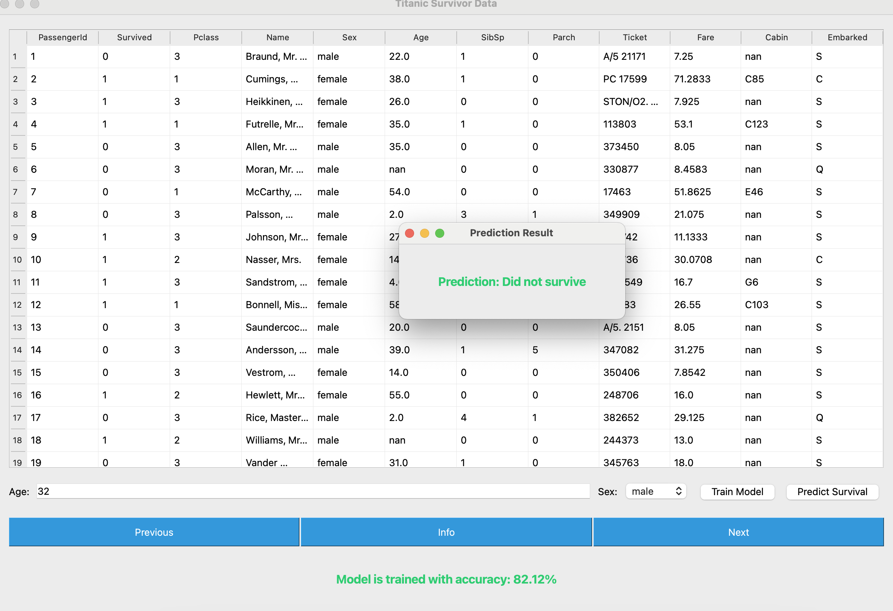

# Titanic Survival Prediction

This is my first attempt at building a prediction application. This app uses popular Titanic dataset and models from scikit-learn to predict the survival rate of a person given age and sex as input.

# Features

The GUI made using pyQT5 reads the dataset and shows the data in a tabular format with pagination. 

# Screenshots

This shows the main window of the application

This shows the result of prediction made for a male aged 32 years.

